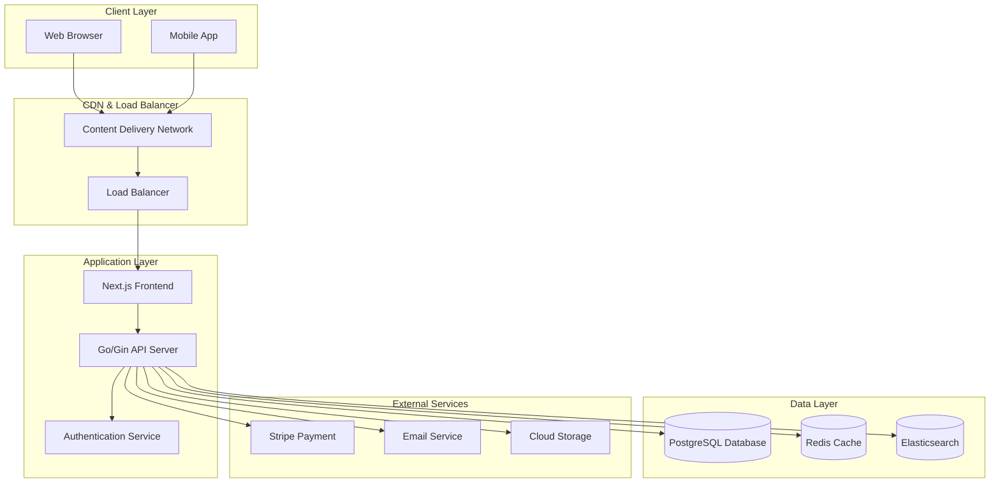

# Ecommerce Website Design Document

## Overview

This design document outlines the architecture for a modern, scalable ecommerce website built with a microservices-oriented approach. The system will be built using React/Next.js for the frontend, Go (Golang) with Gin framework for the backend API, PostgreSQL for data persistence, and integrated with Stripe for payment processing.

The architecture prioritizes security, performance, and maintainability while providing a seamless user experience for both customers and administrators.

## Architecture

### High-Level Architecture



### Technology Stack

- **Frontend**: Next.js 14 with React 18, TypeScript, Tailwind CSS
- **Backend**: Go 1.21+ with Gin framework
- **Database**: PostgreSQL 15 with GORM ORM
- **Caching**: Redis for session storage and application caching
- **Search**: Elasticsearch for product search and filtering
- **Authentication**: JWT with refresh tokens, bcrypt for password hashing
- **Payment Processing**: Stripe API integration
- **File Storage**: AWS S3 or similar cloud storage for product images
- **Email**: SendGrid or similar service for transactional emails

## Components and Interfaces

### Frontend Components

#### Customer-Facing Components
- **Homepage**: Featured products, categories, search bar
- **Product Catalog**: Grid/list view with filtering and sorting
- **Product Detail**: Images, description, reviews, add to cart
- **Shopping Cart**: Item management, quantity updates, checkout button
- **Checkout**: Multi-step process (shipping, payment, confirmation)
- **User Account**: Profile management, order history, wishlist
- **Authentication**: Login, registration, password reset forms

#### Admin Dashboard Components
- **Product Management**: CRUD operations for products and categories
- **Order Management**: Order processing, status updates, fulfillment
- **Customer Management**: Customer accounts and support tools
- **Analytics Dashboard**: Sales reports, inventory tracking
- **Settings**: Site configuration, payment settings

### Backend API Endpoints

#### Authentication Endpoints
```
POST /api/auth/register
POST /api/auth/login
POST /api/auth/logout
POST /api/auth/refresh
POST /api/auth/forgot-password
POST /api/auth/reset-password
```

#### Product Endpoints
```
GET /api/products
GET /api/products/:id
GET /api/products/search
GET /api/categories
POST /api/admin/products (Admin only)
PUT /api/admin/products/:id (Admin only)
DELETE /api/admin/products/:id (Admin only)
```

#### Cart & Order Endpoints
```
GET /api/cart
POST /api/cart/add
PUT /api/cart/update
DELETE /api/cart/remove
POST /api/orders/create
GET /api/orders
GET /api/orders/:id
PUT /api/admin/orders/:id/status (Admin only)
```

#### User Management Endpoints
```
GET /api/users/profile
PUT /api/users/profile
GET /api/users/orders
GET /api/admin/users (Admin only)
```

#### Payment Endpoints
```
POST /api/payments/create-intent
POST /api/payments/confirm
POST /api/webhooks/stripe
```

## Data Models

### Core Entities

#### User Model
```go
type User struct {
    ID        string    `json:"id" gorm:"primaryKey;type:uuid;default:gen_random_uuid()"`
    Email     string    `json:"email" gorm:"uniqueIndex;not null"`
    Password  string    `json:"-" gorm:"not null"` // hashed
    FirstName string    `json:"firstName" gorm:"not null"`
    LastName  string    `json:"lastName" gorm:"not null"`
    Phone     *string   `json:"phone,omitempty"`
    Role      string    `json:"role" gorm:"type:varchar(20);default:'customer'"`
    IsActive  bool      `json:"isActive" gorm:"default:true"`
    CreatedAt time.Time `json:"createdAt"`
    UpdatedAt time.Time `json:"updatedAt"`
    Addresses []Address `json:"addresses,omitempty" gorm:"foreignKey:UserID"`
    Orders    []Order   `json:"orders,omitempty" gorm:"foreignKey:UserID"`
}
```

#### Product Model
```go
type Product struct {
    ID             string                 `json:"id" gorm:"primaryKey;type:uuid;default:gen_random_uuid()"`
    Name           string                 `json:"name" gorm:"not null"`
    Description    string                 `json:"description"`
    Price          float64                `json:"price" gorm:"not null"`
    CompareAtPrice *float64               `json:"compareAtPrice,omitempty"`
    SKU            string                 `json:"sku" gorm:"uniqueIndex;not null"`
    Inventory      int                    `json:"inventory" gorm:"default:0"`
    IsActive       bool                   `json:"isActive" gorm:"default:true"`
    CategoryID     string                 `json:"categoryId" gorm:"not null"`
    Images         []string               `json:"images" gorm:"type:text[]"`
    Specifications map[string]interface{} `json:"specifications" gorm:"type:jsonb"`
    SEOTitle       *string                `json:"seoTitle,omitempty"`
    SEODescription *string                `json:"seoDescription,omitempty"`
    CreatedAt      time.Time              `json:"createdAt"`
    UpdatedAt      time.Time              `json:"updatedAt"`
    Category       Category               `json:"category,omitempty" gorm:"foreignKey:CategoryID"`
    OrderItems     []OrderItem            `json:"orderItems,omitempty" gorm:"foreignKey:ProductID"`
}
```

#### Order Model
```go
type Order struct {
    ID              string    `json:"id" gorm:"primaryKey;type:uuid;default:gen_random_uuid()"`
    UserID          string    `json:"userId" gorm:"not null"`
    Status          string    `json:"status" gorm:"type:varchar(20);default:'pending'"`
    Subtotal        float64   `json:"subtotal" gorm:"not null"`
    Tax             float64   `json:"tax" gorm:"default:0"`
    Shipping        float64   `json:"shipping" gorm:"default:0"`
    Total           float64   `json:"total" gorm:"not null"`
    ShippingAddress Address   `json:"shippingAddress" gorm:"embedded;embeddedPrefix:shipping_"`
    BillingAddress  Address   `json:"billingAddress" gorm:"embedded;embeddedPrefix:billing_"`
    PaymentIntentID string    `json:"paymentIntentId"`
    CreatedAt       time.Time `json:"createdAt"`
    UpdatedAt       time.Time `json:"updatedAt"`
    User            User      `json:"user,omitempty" gorm:"foreignKey:UserID"`
    Items           []OrderItem `json:"items,omitempty" gorm:"foreignKey:OrderID"`
}
```

#### Category Model
```go
type Category struct {
    ID          string     `json:"id" gorm:"primaryKey;type:uuid;default:gen_random_uuid()"`
    Name        string     `json:"name" gorm:"not null"`
    Slug        string     `json:"slug" gorm:"uniqueIndex;not null"`
    Description *string    `json:"description,omitempty"`
    ParentID    *string    `json:"parentId,omitempty"`
    IsActive    bool       `json:"isActive" gorm:"default:true"`
    SortOrder   int        `json:"sortOrder" gorm:"default:0"`
    CreatedAt   time.Time  `json:"createdAt"`
    UpdatedAt   time.Time  `json:"updatedAt"`
    Products    []Product  `json:"products,omitempty" gorm:"foreignKey:CategoryID"`
    Children    []Category `json:"children,omitempty" gorm:"foreignKey:ParentID"`
    Parent      *Category  `json:"parent,omitempty" gorm:"foreignKey:ParentID"`
}
```

### Database Schema Design

The database will use PostgreSQL with the following key design principles:
- Normalized structure to reduce data redundancy
- Proper indexing on frequently queried fields (email, sku, category)
- Foreign key constraints to maintain data integrity
- Soft deletes for products and categories to preserve order history
- Audit trails with created/updated timestamps

## Error Handling

### API Error Response Format
```go
type ApiError struct {
    Success   bool        `json:"success"`
    Error     ErrorDetail `json:"error"`
    Timestamp string      `json:"timestamp"`
    Path      string      `json:"path"`
}

type ErrorDetail struct {
    Code    string      `json:"code"`
    Message string      `json:"message"`
    Details interface{} `json:"details,omitempty"`
}
```

### Error Categories
- **Validation Errors (400)**: Invalid input data, missing required fields
- **Authentication Errors (401)**: Invalid credentials, expired tokens
- **Authorization Errors (403)**: Insufficient permissions
- **Not Found Errors (404)**: Resource doesn't exist
- **Conflict Errors (409)**: Duplicate email, insufficient inventory
- **Server Errors (500)**: Database connection issues, external service failures

### Error Handling Strategy
- Global error middleware for consistent error responses
- Input validation using Joi or Zod schemas
- Database transaction rollbacks on errors
- Graceful degradation for external service failures
- Comprehensive logging for debugging and monitoring

## Testing Strategy

### Frontend Testing
- **Unit Tests**: Component testing with Jest and React Testing Library
- **Integration Tests**: API integration and user flow testing
- **E2E Tests**: Critical user journeys with Playwright or Cypress
- **Visual Regression Tests**: UI consistency across browsers

### Backend Testing
- **Unit Tests**: Individual function and service testing with Go's built-in testing package and Testify
- **Integration Tests**: Database operations and API endpoint testing with test containers
- **Contract Tests**: API contract validation with Go test suites
- **Load Tests**: Performance testing with Artillery or k6

### Test Coverage Goals
- Minimum 80% code coverage for critical business logic
- 100% coverage for payment processing and security functions
- Automated testing in CI/CD pipeline
- Regular security penetration testing

### Testing Environment
- Separate test database with seed data
- Mock external services (Stripe, email) in tests
- Automated test runs on pull requests
- Performance benchmarking on staging environment